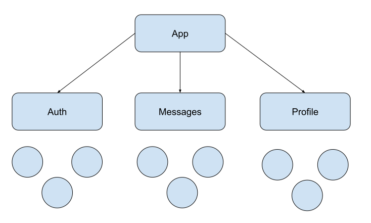

# Code splitting

In a large application, there is a need to break the code into many small bundles. This allows you to make the project come alive much earlier so that your users do not feel uncomfortable.

> NOTE. See more info about code splitting in [webpack docs](https://webpack.js.org/guides/code-splitting/)

We also adhere to this idea and tried to make Reatom with the expectation of this behavior.

In this guide we show the basic behavior of `@reatom/core` without reference to any template engine.



## Lazy atoms

First, let's create our store (context for storing atom data)

### Step 1. Create your store
```js
import { createStore } from '@reatom/core'

const store = createStore()
```

### Step 2. Connect atoms to the store
```js
import { myAtom, myOtherAtom } from './model'

const unsubscribe1 = store.subscribe(myAtom, () => {
  // ...do something
})

const unsubscribe2 = store.subscribe(myOtherAtom, () => {
  // ...do something
})
```

### Step 3. Clean up data
```js
unsubscribe1()
unsubscribe2()
```


## Global atoms

There are several ways to make global atoms that won't clean up their data.

### Method 1.

To connect the atoms during the creation of the store

```js
import { createStore, combine } from '@reatom/core'
import { myAtom, myOtherAtom } from './model'

const rootAtom = combine([myAtom, myOtherAtom])

const store = createStore(rootAtom)
```

### Method 2.

To connect lazily, but to make an ongoing subscription.

```js
import { createStore, combine } from '@reatom/core'
import { myAtom, myOtherAtom } from './model'

const rootAtom = combine([myAtom, myOtherAtom])

const store = createStore()

const unsubscribe = store.subscribe(rootAtom, () => {
  // ...do something
})
```
